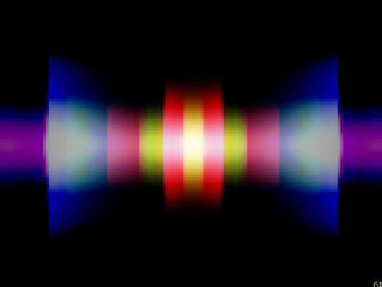

# music_visualizer

根据[scottlawsonbc/audio-reactive-led-strip](https://github.com/scottlawsonbc/audio-reactive-led-strip)改编的音乐可视化软件。

实现了三种显示效果。按键：
* S 频谱
* B 棒图
* E 向两侧扩展

其他按键
* F 全屏
* Q 退出

  
  
  

如果不想用麦克风采集声音，在 Mac 上可以使用 Loopback Audio。
